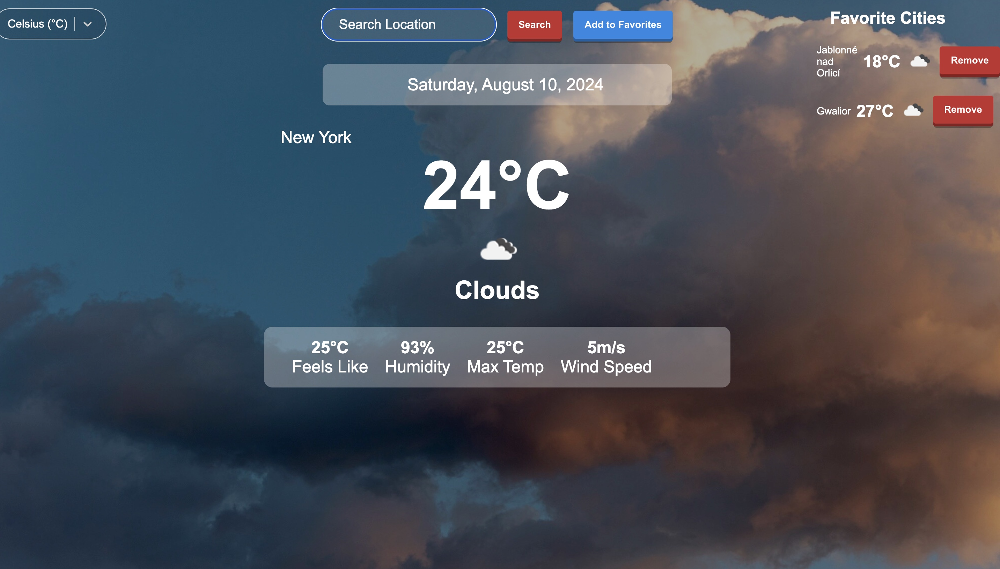

Description

The Forecast Fusion is a React application that allows users to search for weather information for different locations. It provides features like unit conversion between Celsius and Fahrenheit, saving favorite locations, and retrieving weather data using the OpenWeatherMap API. The app also uses a JSON server to manage and persist favorite locations.

Features

Search for weather information by city name.
Display current weather, temperature, and other weather details.
Convert temperature units between Celsius and Fahrenheit.
Save and manage favorite locations.
Local storage for the last searched city.
Display a loading spinner during data fetching.
Error handling with alert messages.
Technologies Used

Frontend: React, React-Select, React-Awesome-Button
Backend: JSON Server
API: OpenWeatherMap API
Styling: Custom CSS, React-Awesome-Button Styles
Installation

Prerequisites
Ensure you have the following installed:

- Node.js (v14 or later)
- npm (or yarn)
- Clone the Repository
- bash
- Copy code
- git clone https://github.com/HimanshuRajpoot2301/weather_app.git
- cd weather-app
- Install Dependencies
- bash
- Copy code
- npm install
- or
yarn install
Start the JSON Server
The application uses a JSON server to manage favorites. Start the server by running:

bash
Copy code
npm run server
Start the React Application
bash
Copy code
npm start
# or
yarn start

## Screenshots

Usage

Search for Weather: Enter the name of a city in the search bar and press Enter or click "Search" to retrieve the weather data.
Add to Favorites: Click the "Add to Favorites" button to save the current weather data for quick access later.
Manage Favorites: View and remove favorite locations from the sidebar.
Unit Conversion: Select between Celsius (°C) and Fahrenheit (°F) to change the temperature unit.

